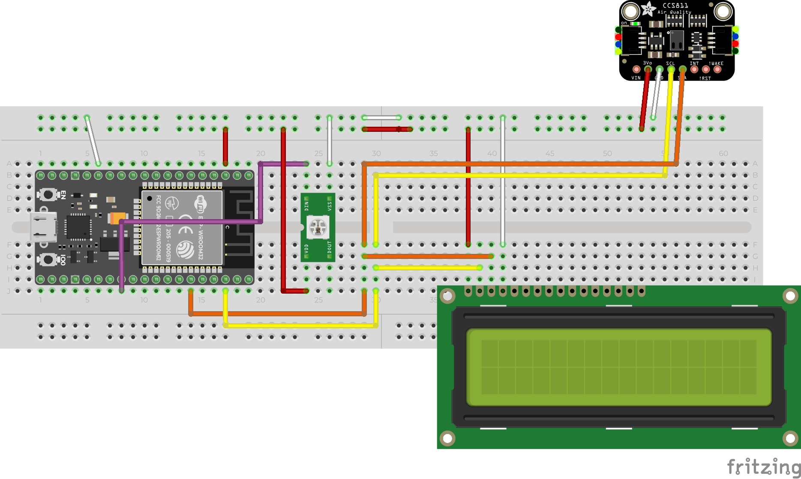

# 空気品質モニター Air Quality Monitor

空気品質センサモジュールを買ったので、ESP32 で使って表示するようにしました。

https://www.switch-science.com/catalog/3298/

## Features

- LCD ディスプレイに、二酸化炭素濃度と、tVOC を表示。
- 二酸化炭素濃度が 1,600ppm を超えると、LED が赤く光る。

## Parts

- ESP32-WROOM-32D DevKit: https://www.amazon.co.jp/gp/product/B0718T232Z/
- CCS811 搭載空気品質センサモジュール: https://www.switch-science.com/catalog/3298/
- RGB LED SK6812MINI-E: https://akizukidenshi.com/catalog/g/gI-15478/
  - WS2812 と同様の仕様で動作します。
  - ただ、手元にあったからこの LED を使っただけで、特別これを選んだわけではない。
- I2C Character Display AQM0802A-RN-GBW: https://akizukidenshi.com/catalog/g/gP-06669/
  - I2C が楽そうだった。

## Circuit Diagram

### Using Fritzing Parts

- HiLetGo ESP32 https://forum.fritzing.org/t/esp32s-hiletgo-dev-boad-with-pinout-template/5357
- CCS811 https://github.com/adafruit/Fritzing-Library/blob/master/parts/Adafruit%20CCS811.fzpz

## Reference

- CCS811 プログラムデータガイド（Sparkfun）: https://cdn.sparkfun.com/datasheets/BreakoutBoards/CCS811_Programming_Guide.pdf
- SparkFun CCS811 Arduino Library : https://github.com/sparkfun/SparkFun_CCS811_Arduino_Library/
- SK6812MINI-E データシート（秋月）: https://akizukidenshi.com/download/ds/opscoled/sk6812mini-e.pdf
- AQM0802A-RN-GBW データシート（秋月） \_ https://akizukidenshi.com/download/ds/xiamen/AQM0802.pdf

## LICENSE

MIT

## 余談

最初は Raspberry Pi PICO を使っていましたが、Google Home と連携させたくなったら、やっぱり WiFi 使えないとと思い、それならば ESP32 で良いのでは？？となって、ESP32 に載せ替えました。SK1812Mini の実装以外はそのまま動きました。

## History

- 2021/05/05 Raspberry Pi PICO から ESP32 に乗せ替え
